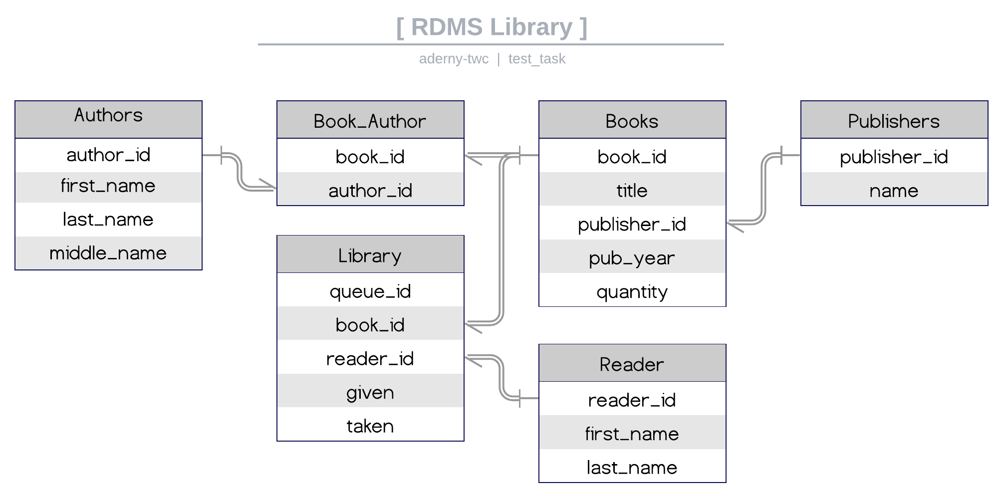

# Задача 1
> Опишите модель данных (в любом удобном для вас представлении) для обслуживания библиотеки. Это может быть описание таблиц с типами данных, диаграмма – что угодно.
>

### Общий вид модели данных:

---

### Описание таблиц

#### Authors (автор)

| Колонка     | Типы данных                     | Описание             |
| ----------- | ------------------------------- | -------------------- |
| author_id   | int, auto_increment, unique, pk | Идентификатор автора |
| first_name  | varcahr(100), not null          | Имя                  |
| last_name   | varcahr(100)                    | Фамилия              |
| middle_name | varcahr(100),                   | Отчество             |

#### Books (книги)

| Колонка      | Типы данных                     | Описание               |
| ------------ | ------------------------------- | ---------------------- |
| book_id      | int, auto_increment, unique, pk | Идентификатор книги    |
| title        | varcahr(200), not null          | Название               |
| publisher_id | int, not null, fk               | Идентификатор издателя |
| pub_date     | timestamp, not null             | Дата издания           |
| quantity     | int, default null               | Количество             |

#### Publishers (издатель)

| Колонка      | Типы данных                     | Описание               |
| ------------ | ------------------------------- | ---------------------- |
| publisher_id | int, auto_increment, unique, pk | Идентификатор издателя |
| name         | varcahr(400), not null          | Наименование           |

#### Readers (читатель)

| Колонка    | Типы данных                     | Описание               |
| ---------- | ------------------------------- | ---------------------- |
| reader_id  | int, auto_increment, unique, pk | Идентификатор читателя |
| first_name | varcahr(100), not null          | Имя                    |
| last_name  | varcahr(100), not null          | Фамилия                |

#### Library (библиотека)

| Колонка   | Типы данных                     | Описание             |
| --------- | ------------------------------- | -------------------- |
| queue_id  | int, auto_increment, unique, pk | Идентификатор выдачи |
| book_id   | int,  fk                        | Книга                |
| reader_id | int,  fk                        | Читатель             |
| given     | timestamp, not null             | Выдана               |
| taken     | timestamp, default null         | Возвращена           |

#### Book_Author (m2m)

| Колонка   | Типы данных | Описание             |
| --------- | ----------- | -------------------- |
| book_id   | int,  fk    | Идентификатор книги  |
| author_id | int,  fk    | Идентификатор автора |

---

### Создание таблицы

[Пример создания таблицы PostgreSQL](./addition/create_table.sql)

​		Следующее задание [Задание 2](./tasks/task_2.md)